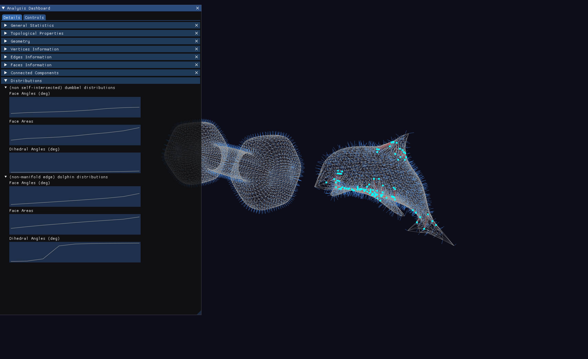
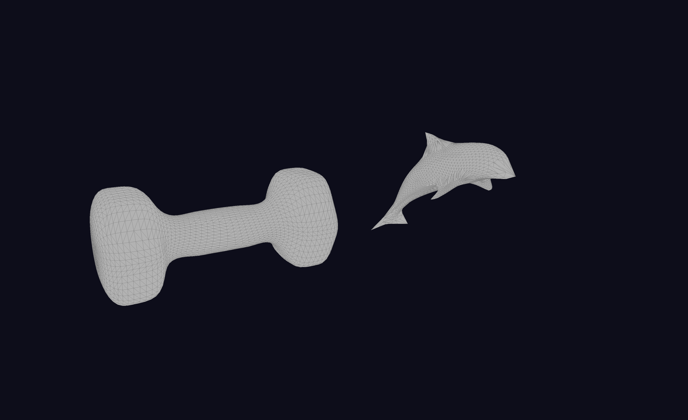
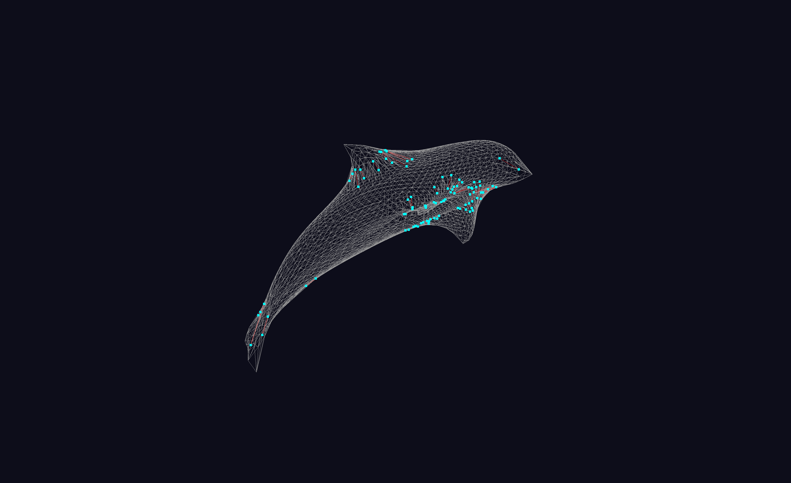
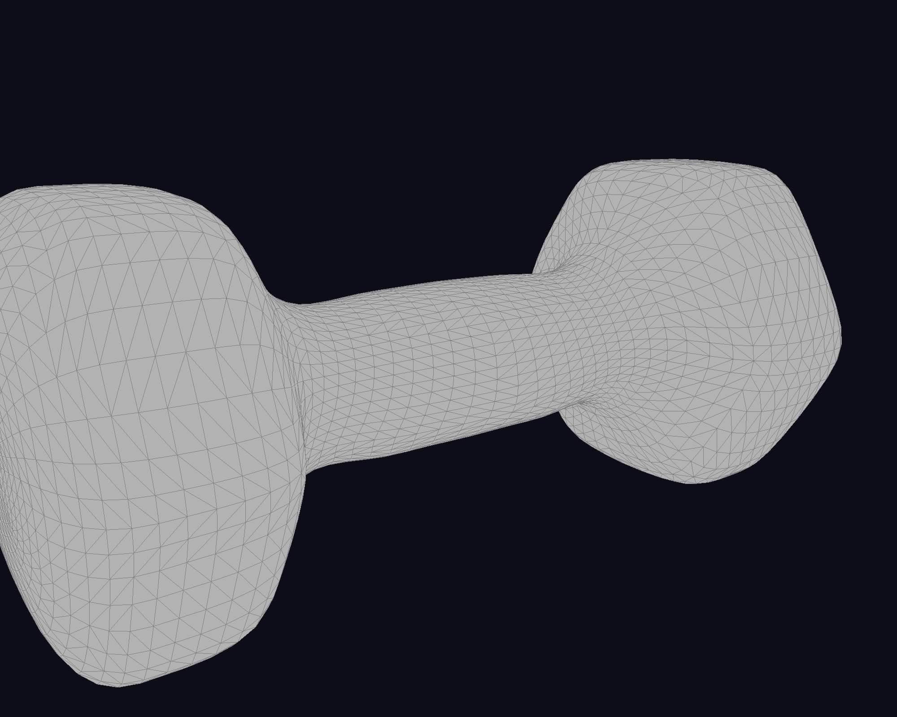
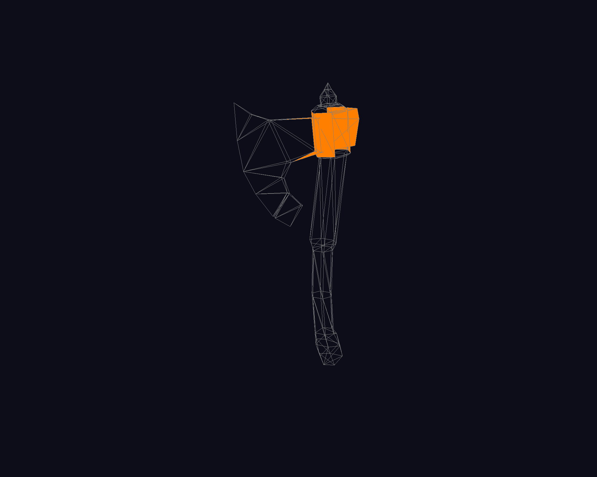
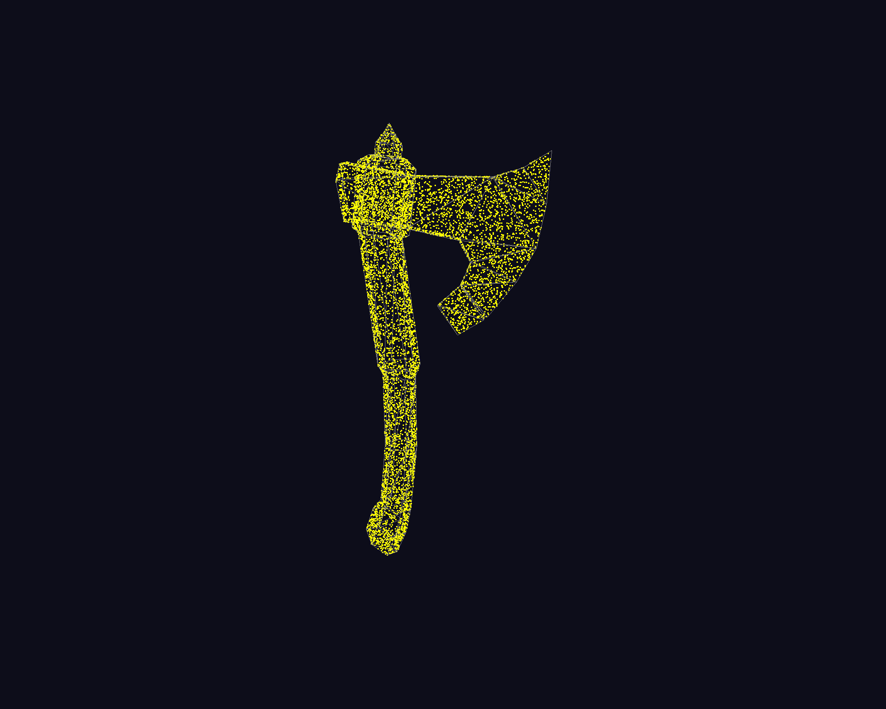
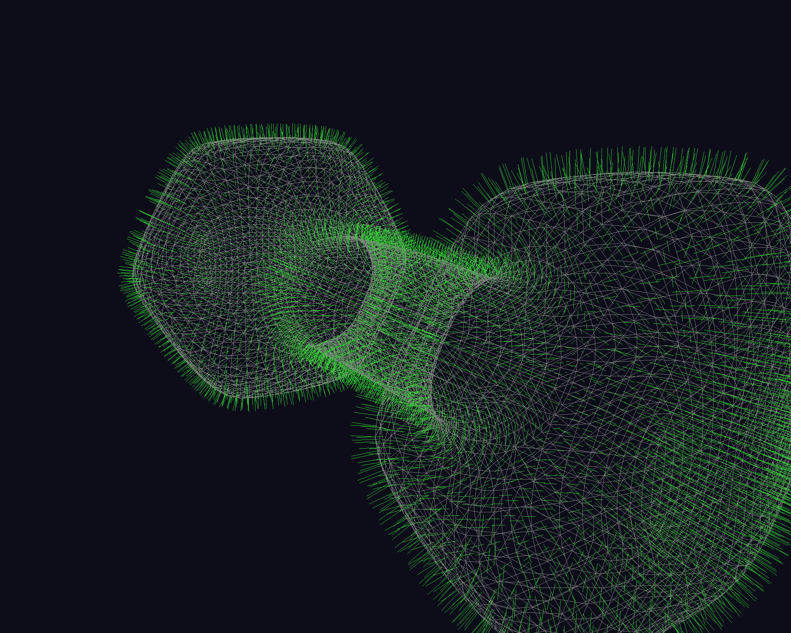
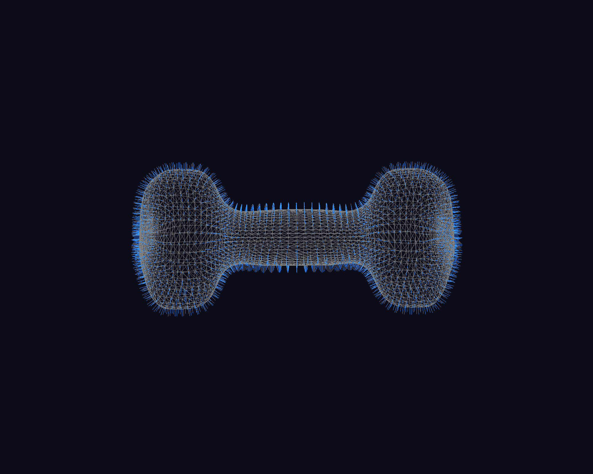
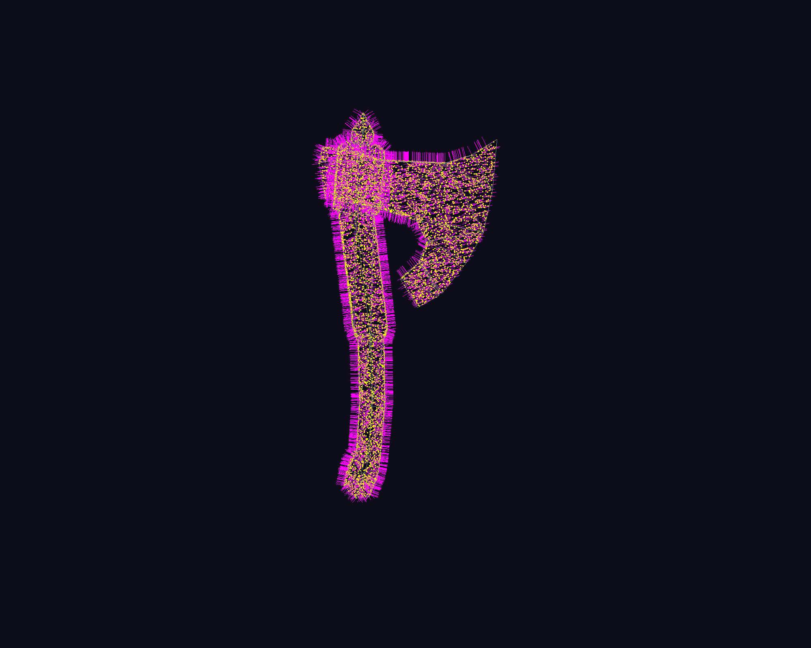

# Mesh Analysis and Visualization for Research

A powerful 3D mesh and point cloud analysis and visualization toolkit built with ModernGL and Python. Load, inspect, and analyze 3D mesh and point cloud files with real-time rendering and comprehensive geometric analysis.

## Overview

### Diagnostic & Comparison
|  |  |  |
|:---:|:---:|:---:|
| **Analysis Dashboard** | **Multi-mesh Comparison** | **Non-manifold Detection** |

### Visualization Modes
|  |  |  |
|:---:|:---:|:---:|
| **Solid & Wireframe Modes** | **Self-intersection** | **Point Cloud** |
|  |  |  |
| **Face Normals** | **Vertex Normals** | **Point Cloud Normals** |

## Installation

### Requirements
- Python 3.7+
- OpenGL 3.3+ capable graphics card

### Setup

**Running with Repo**
```bash
git clone https://github.com/KhoiDOO/meshinfo.git
cd meshinfo
```

**Create conda env**
```bash
conda create -n meshviewer python=3.10
conda activate meshviewer
pip install .
```

**Install as Python Package:**
```bash
pip install git+https://github.com/KhoiDOO/meshinfo.git
```

## Getting Started

### Mesh Viewer
```bash
python main.py
# Press O to open a mesh file
# See docs/VIEWER.md for full documentation
```
Enable mesh intersection checking (can be expensive on large meshes):
```bash
python main.py --intersect
```
Enable non-manifold vertex checking:
```bash
python main.py --nonmanifold
```
Enable additional analysis flags:
```bash
python main.py --components --geometry --topology
```

### Mesh Anlysis
In case you want to just analyze your mesh w/o viewing it, we provide APIs to do.
First install as a Python package, then
```python
from meshinfo import MeshInfo

mesh_path = "your_mesh_file"
filename = os.path.basename(mesh_path).split(".")[0]
mesh = trimesh.load()
mesh_info = MeshInfo(
    mesh,
    name=filename,
    check_intersection=True,
    check_components=True,
    check_nonmanifold_vertices=True,
    check_geometry=True,
    check_topology=True,
    verbose=True
)

mesh_dict = mesh_info.to_dict(nested=True)
```

## Features at a Glance

### Mesh Viewer (main.py)
- ✅ **Interactive Analysis Dashboard**: Real-time side panel (Press 'G' to toggle)
- ✅ **Comparison Table**: Side-by-side metrics for multiple meshes
- ✅ Multi-mesh loading with automatic grid layout
- ✅ Topology analysis: self-intersections, non-manifold detection
- ✅ Visualization: face/vertex normals, point clouds, wireframe overlays
- ✅ Comprehensive mesh statistics in console and UI
- ✅ Side-by-side mesh comparison

### Point Cloud Viewer (main_pc.py)
- ✅ Multi-cloud loading with synchronized views
- ✅ GPU-optimized rendering for millions of points
- ✅ Support for colored point clouds (RGB)
- ✅ Adaptive point sizing and camera controls
- ✅ Multi-format support (XYZ, LAS, LAZ, PLY)

## Documentation

Detailed documentation for each application:

- **[Mesh Viewer Documentation](docs/MESH_VIEWER.md)** - Full guide for `main.py`
  - Mesh topology analysis features
  - Keyboard controls and usage workflow
  - Supported formats and sample meshes
  - Performance optimization tips

## Sample Data

Both applications include sample data for testing:

- **Mesh Samples** (`samples`)
  - Test meshes with known topology issues
  - Good for validation and demonstration
  - See [samples/README.md](samples/README.md)

## Architecture

### Technologies Used
- **Rendering**: ModernGL (OpenGL 3.3 Core Profile) with GLSL shaders
- **GUI**: ImGui (pyimgui) for the analysis dashboard
- **Mesh Processing**: Trimesh library for geometry operations
- **Collision Detection**: FCL (Flexible Collision Library) BVH
- **Windowing**: GLFW for window management and input
- **File I/O**: NumPy, Trimesh, Laspy (optional)

## License

See [LICENSE](LICENSE) file for details.